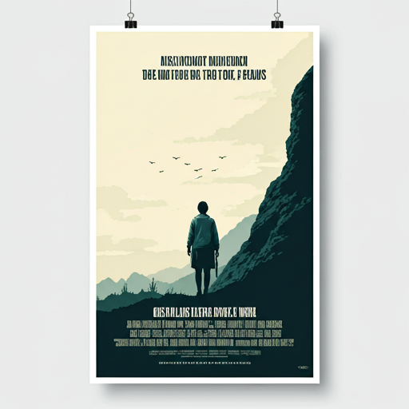
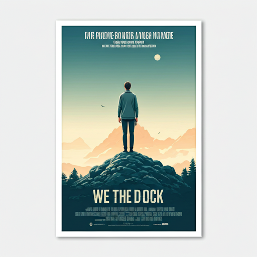
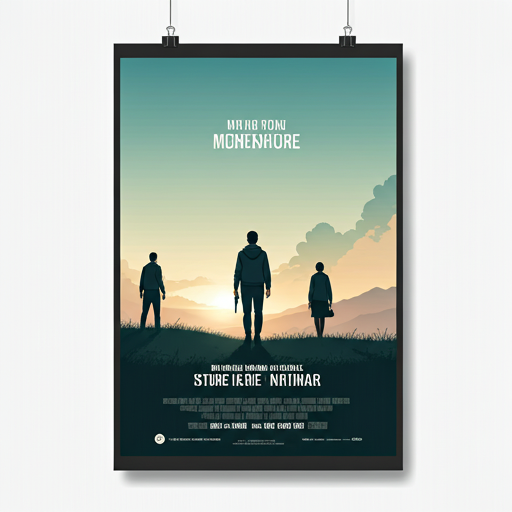
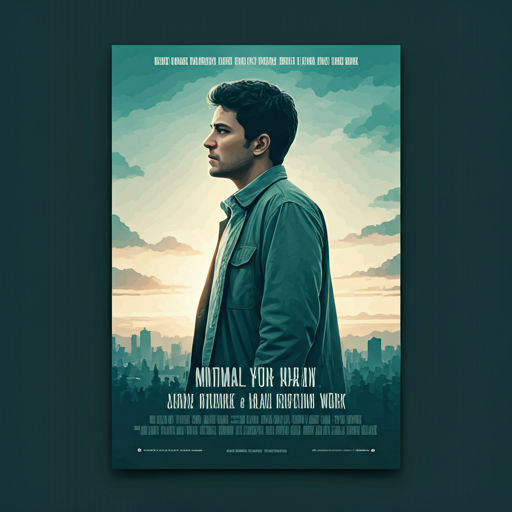

# 🎬 Movie App

This repository contains a Movie App developed as a task in **DEPI**.  
The application features two main pages:  

- **Home Page** – Displays a list of movies with details.  
- **Watched List Page** – Allows users to track movies they’ve watched.  

I focused on implementing **Clean Architecture principles**.  
For state management, I applied different approaches including `setState` for simple scenarios and `Provider` for more complex handling.  

---

## ✨ Features

*   **Home Page:** Displays a list of movies with details.  
*   **Watched List Page:** Allows users to track movies they’ve watched.  
*   **Local Data Storage:** The application uses local data for movie information.  
*   **Clean Architecture:** Implemented for a scalable and maintainable codebase.  
*   **State Management:** Utilizes `setState` for simple scenarios and `Provider` for more complex state management.  

---

## 🛠️ Technologies Used

*   **Flutter:** UI toolkit.  
*   **Dart:** Programming language.  
*   **Local Storage:** For data persistence.  
*   **Provider:** For state management.  

---

## 📸 Screenshots

Below are screenshots of various pages within the application, providing a visual overview of its functionality and design.  

### Application Screenshots

| Screen Name | Screenshot |
|---|---|
| Book 1 |  |
| Book 2 |  |
| Book 3 |  |
| Book 4 |  |
| Book 5 |  |
| Book 6 |  |
| Book 7 |  |
| Book 8 |  |
| Book 9 |  |
| Book 10 |  |
| Book 11 |  |
| Book 12 |  |
| Book 13 |  |
| Book 14 |  |

---

## 🚀 Getting Started

To get a local copy up and running, follow these simple steps.  

### Prerequisites

Make sure you have Flutter installed on your machine.  
If not, follow the official Flutter installation guide:  
👉 [Install Flutter](https://flutter.dev/docs/get-started/install)  

### Installation

1. Clone the repository:
    ```bash
    git clone https://github.com/AhmedAbdelaal345/Movie_App.git
    ```
2. Navigate to the project directory:
    ```bash
    cd Movie_App
    ```
3. Get the dependencies:
    ```bash
    flutter pub get
    ```
4. Run the app:
    ```bash
    flutter run
    ```

---
