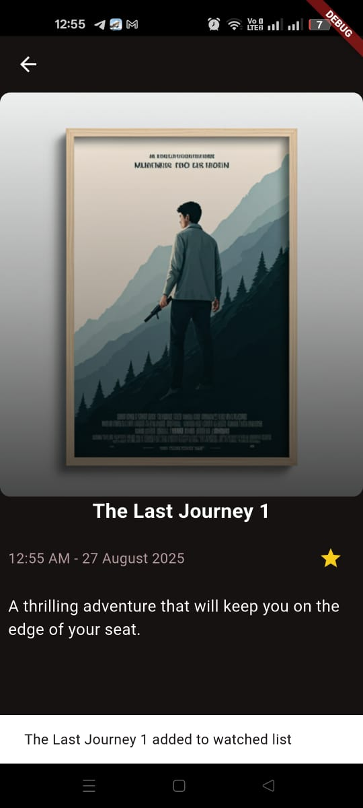
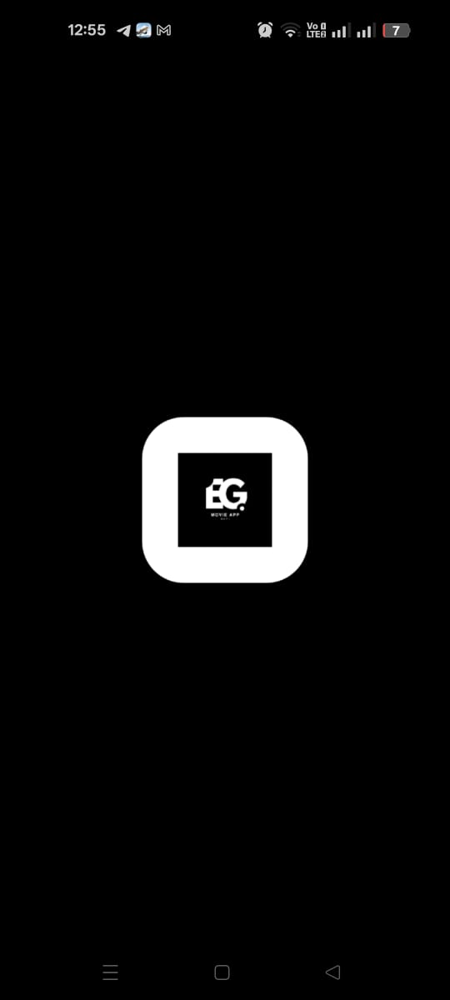
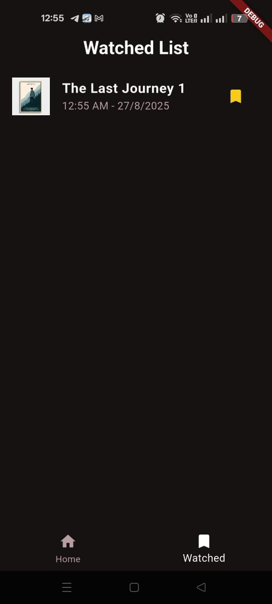

# 🎬 Movie App  

  
  
  

This repository contains a **Movie App** developed as a task in **DEPI (Digital Egypt Pioneers Initiative)**.  

The application has two main pages:  

- 🏠 **Home Page** – Displays a list of movies with details.  
- ✅ **Watched List Page** – Allows users to track movies they’ve watched.  

The app is built with **Clean Architecture** and uses both `setState` and `Provider` for state management.  

---

## ✨ Features  

✅ **Home Page:** Browse movies with details & search functionality.  
✅ **Watched List Page:** Track and manage watched movies.  
✅ **Local Data Storage:** Stores and retrieves movie info locally.  
✅ **Clean Architecture:** Ensures scalable & maintainable code.  
✅ **State Management:** Combination of `setState` and `Provider`.  

---

## 🛠️ Technologies Used  

- **Flutter** – UI toolkit.  
- **Dart** – Programming language.  
- **Local Storage** – Data persistence.  
- **Provider** – State management.  

---

## 📸 Screenshots  

| Screen Name | Screenshot | Description |
|---|---|---|
| 🏠 Home Page |  | Main movie catalog with featured & all movies. |
| 🎥 Item Details |  | Shows detailed info about a movie with option to mark as watched. |
| 🚀 Splash Page |  | Initial loading screen showing app logo. |
| ✅ Watched List |  | List of movies the user has marked as watched. |

---

## 🚀 Getting Started  

### Prerequisites  
Make sure you have Flutter installed. 👉 [Install Flutter](https://flutter.dev/docs/get-started/install)  

### Installation  

1. Clone the repository:  
    ```bash
    git clone https://github.com/AhmedAbdelaal345/Movie_App.git
    ```
2. Navigate to the project directory:  
    ```bash
    cd Movie_App
    ```
3. Get the dependencies:  
    ```bash
    flutter pub get
    ```
4. Run the app:  
    ```bash
    flutter run
    ```
